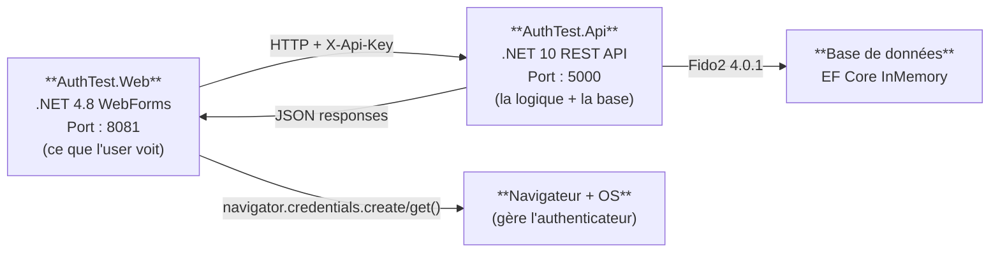
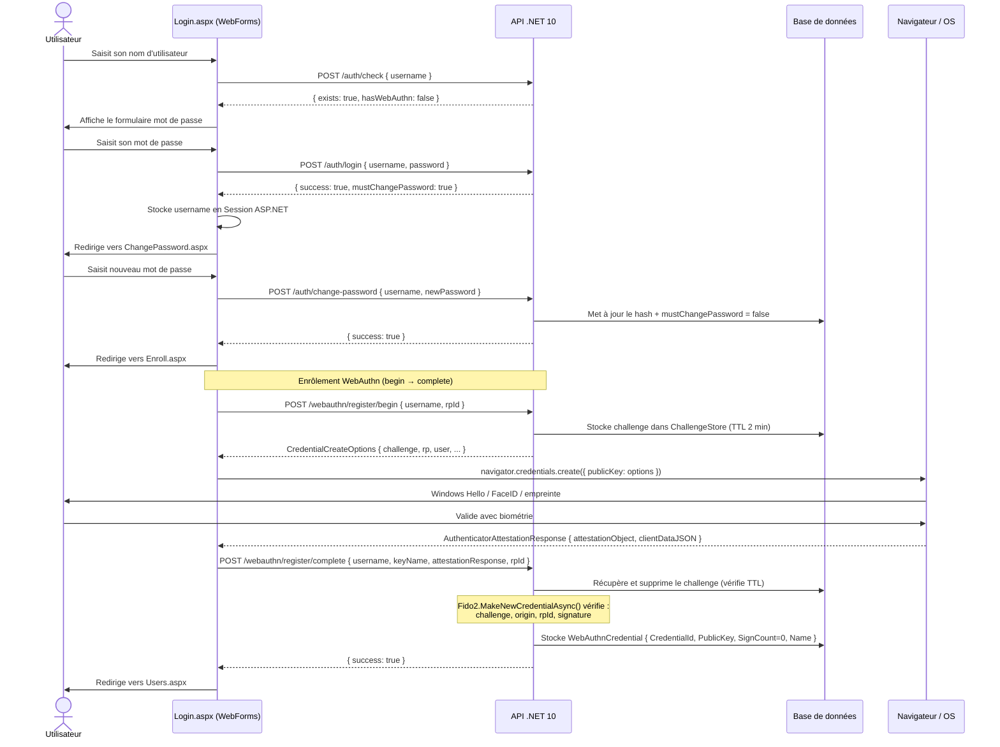
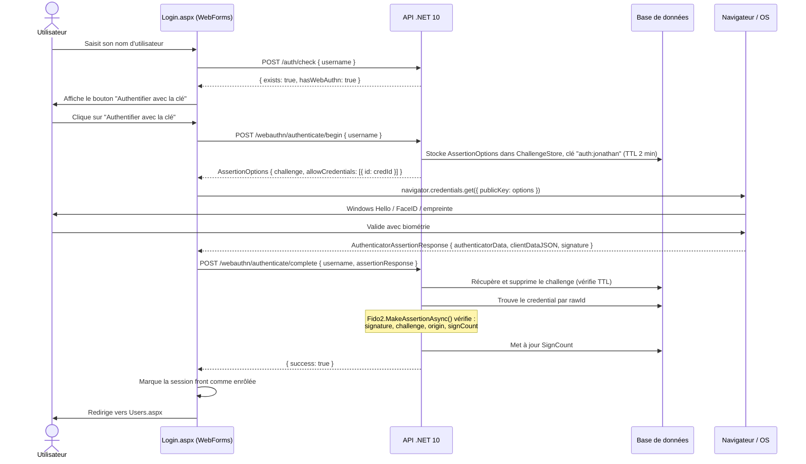
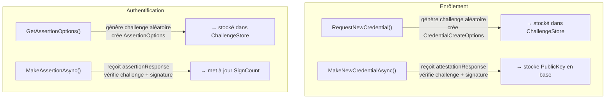
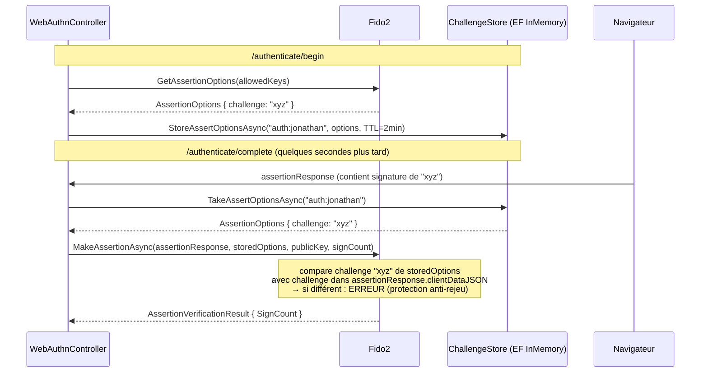
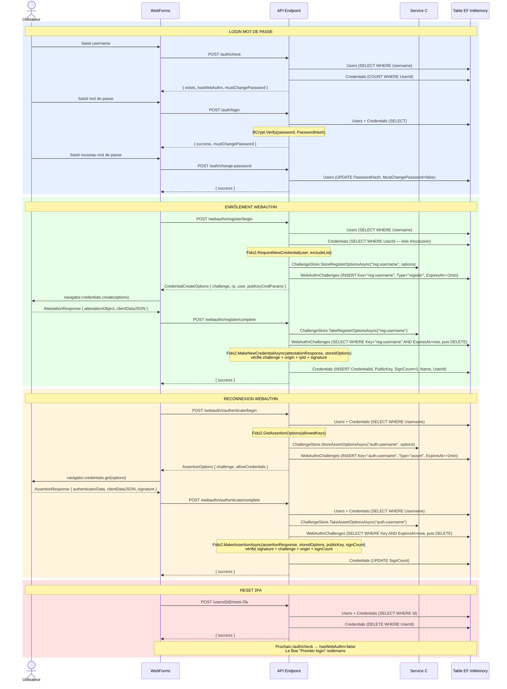

# AUTHENTEST — GUIDE DÉBUTANT
## WebAuthn : enrôlement et connexion

---

## PARTIE 1 — LES BASES : C'EST QUOI WEBAUTHN ?

WebAuthn, c'est un standard web qui permet de se connecter SANS mot de
passe, en utilisant un "authenticateur" : capteur d'empreinte, Face ID,
Windows Hello, clé USB YubiKey...

L'idée clé : ton authenticateur possède une PAIRE DE CLÉS CRYPTOGRAPHIQUES.
- La clé **PRIVÉE** ne quitte JAMAIS ton appareil (elle est dans une puce sécurisée)
- La clé **PUBLIQUE** est envoyée au serveur lors de l'enrôlement

Pour s'authentifier, le serveur envoie un défi (challenge), l'authenticateur
le SIGNE avec sa clé privée, et le serveur vérifie avec la clé publique.
Sans la clé privée = impossible de forger une signature = sécurité forte.

---

## PARTIE 2 — ARCHITECTURE DU PROJET



---

## PARTIE 3 — PARCOURS 1 : PREMIER LOGIN (ENRÔLEMENT OBLIGATOIRE)

Situation : un utilisateur existe en base (jonathan / Pas$word2),
mais n'a pas encore enregistré de clé WebAuthn.



### Détail de l'étape d'enrôlement (4c)

L'API vérifie avec Fido2 :
1. Le challenge correspond bien à celui stocké en base
2. L'origin est bien `http://localhost:8081`
3. Le rpId est bien `localhost`
4. La signature de l'attestationObject est valide

Si OK, stocke en base :
```
WebAuthnCredential {
  CredentialId = byte[]   ← identifiant unique de la clé
  PublicKey    = byte[]   ← clé publique COSE pour vérifier les signatures futures
  SignCount    = 0        ← compteur anti-rejeu, commence à 0
  Name         = "Ma clé perso"
}
```

> **IMPORTANT** : le JS convertit les ArrayBuffer en base64url avant d'envoyer
> (les bytes ne passent pas directement en JSON)

---

## PARTIE 4 — PARCOURS 2 : RECONNEXION WEBAUTHN

Situation : l'utilisateur revient, il a déjà une clé enrôlée.



### Ce que vérifie MakeAssertionAsync

1. La **SIGNATURE** avec la clé publique stockée en base
2. Que le **challenge** correspond (anti-rejeu)
3. Que l'**origin** est bien dans la liste autorisée
4. Que **signCount** >= signCount précédent (détection clonage)

---

## PARTIE 5 — COMMENT FIDO2NETLIB GÈRE LES CHALLENGES

Fido2 est la bibliothèque C# qui implémente le protocole WebAuthn côté serveur.
Elle expose 4 méthodes principales, chacune liée à une étape du protocole.



### RequestNewCredential() — Enrôlement, étape 1

```csharp
var options = _fido2.RequestNewCredential(new RequestNewCredentialParams
{
    User = fidoUser,                        // { Id, Name, DisplayName }
    ExcludeCredentials = existingKeys,      // clés déjà enrôlées (pour éviter les doublons)
    AuthenticatorSelection = new AuthenticatorSelection
    {
        AuthenticatorAttachment = AuthenticatorAttachment.Platform,  // capteur interne uniquement
        UserVerification = UserVerificationRequirement.Preferred
    },
    AttestationPreference = AttestationConveyancePreference.None
});
// options contient un challenge aléatoire (byte[]) → à stocker dans ChallengeStore
// options est envoyé au navigateur qui l'utilise pour appeler navigator.credentials.create()
```

### MakeNewCredentialAsync() — Enrôlement, étape 2

```csharp
var makeResult = await _fido2.MakeNewCredentialAsync(new MakeNewCredentialParams
{
    AttestationResponse = req.AttestationResponse,   // réponse du navigateur
    OriginalOptions = storedOptions,                  // options récupérées du ChallengeStore
    IsCredentialIdUniqueToUserCallback = isUniqueCallback
});
// makeResult.Id        → identifiant de la nouvelle clé (CredentialId)
// makeResult.PublicKey → clé publique COSE à stocker en base
```

Fido2 vérifie en interne :
- Que `clientDataJSON.challenge` == challenge dans `OriginalOptions` → **anti-rejeu**
- Que `clientDataJSON.origin` est dans la liste des origins autorisées → **anti-phishing**
- Que `clientDataJSON.type` == `"webauthn.create"`
- Que la signature de l'`attestationObject` est valide

### GetAssertionOptions() — Authentification, étape 1

```csharp
var options = _fido2.GetAssertionOptions(new GetAssertionOptionsParams
{
    AllowedCredentials = allowedKeys,   // liste des CredentialId de cet utilisateur
    UserVerification = UserVerificationRequirement.Preferred
});
// options contient un NOUVEAU challenge aléatoire → à stocker dans ChallengeStore
// options est envoyé au navigateur qui l'utilise pour appeler navigator.credentials.get()
```

### MakeAssertionAsync() — Authentification, étape 2

```csharp
var result = await _fido2.MakeAssertionAsync(new MakeAssertionParams
{
    AssertionResponse = assertionResponse,         // réponse du navigateur
    OriginalOptions = storedOptions,               // options récupérées du ChallengeStore
    StoredPublicKey = credential.PublicKey,        // clé publique stockée en base
    StoredSignatureCounter = credential.SignCount, // compteur stocké en base
    IsUserHandleOwnerOfCredentialIdCallback = isUserOwner
});
// result.SignCount → nouveau compteur à sauvegarder en base
```

Fido2 vérifie en interne :
- Que `clientDataJSON.challenge` == challenge dans `OriginalOptions` → **anti-rejeu**
- Que `clientDataJSON.origin` est dans la liste autorisée → **anti-phishing**
- Que `clientDataJSON.type` == `"webauthn.get"`
- Que la **signature** dans `assertionResponse` est valide avec `StoredPublicKey`
- Que `signCount > StoredSignatureCounter` (sauf si signCount == 0) → **anti-clonage**

### Pourquoi le ChallengeStore est indispensable avec Fido2



Le challenge est généré côté serveur (pas côté client) pour garantir
que c'est bien le serveur qui contrôle ce qui est signé.
Un attaquant ne peut pas réutiliser une ancienne signature car le challenge
change à chaque fois.

---

## PARTIE 6 — POINTS D'ATTENTION DÉVELOPPÉS

### ⚠️ POINT 1 : Stockage InMemory — tout disparaît au redémarrage

La base de données est créée en mémoire avec Entity Framework InMemory.
C'est pratique pour un POC, mais :
- Si tu redémarres l'API → tous les utilisateurs sont recréés à partir
  du seed (jonathan, virginie) SANS leurs clés WebAuthn
- Leurs credentials (clés publiques) sont perdus
- Il faudra ré-enrôler les clés WebAuthn à chaque redémarrage API

Pour la production, il faudra remplacer `UseInMemoryDatabase("AuthTestDb")`
par une vraie base SQL (PostgreSQL, SQL Server, etc.)


### ⚠️ POINT 2 : ChallengeStore — vestiaire temporaire des défis cryptographiques

WebAuthn fonctionne en deux allers-retours (begin → complete).
Entre les deux, le serveur doit mémoriser le challenge qu'il a généré,
pour pouvoir vérifier la réponse du navigateur.

La table `WebAuthnChallenge` contient :
- `Key`         : identifiant du challenge (ex: token de session, `"auth:jonathan"`)
- `Type`        : `"register"` (enrôlement) ou `"assert"` (authentification)
- `OptionsJson` : les options complètes sérialisées en JSON
- `ExpiresAt`   : date d'expiration (2 minutes après création)

**TTL — Durée de vie de 2 minutes**

Chaque challenge expire automatiquement après 2 minutes (TTL = Time To Live).
Pourquoi c'est important :
- Si quelqu'un intercepte le challenge, il ne peut pas l'utiliser plus tard
- L'utilisateur a 2 minutes pour poser son doigt sur le capteur
- À chaque `Store*`, les lignes expirées sont supprimées automatiquement

```csharp
// Stocker un challenge (TTL 2 min)
db.Challenges.Add(new WebAuthnChallenge {
    Key = tokenSession,
    Type = "register",
    OptionsJson = options.ToJson(),
    ExpiresAt = DateTime.UtcNow.AddMinutes(2)   // le TTL
});

// Récupérer et consommer un challenge
var row = db.Challenges.FirstOrDefault(
    c => c.Key == key && c.ExpiresAt > DateTime.UtcNow  // filtre TTL
);
if (row is null) return BadRequest("No pending challenge"); // expiré ou inexistant
db.Challenges.Remove(row);  // consommé → ne peut plus être réutilisé
```

**Comportement Scoped (pas Singleton)**

`ChallengeStore` est enregistré en `Scoped` dans la DI (pas `Singleton`),
parce qu'il dépend de `AppDbContext` qui est lui-même Scoped.
Cela signifie qu'une nouvelle instance est créée à chaque requête HTTP.

Pour le multi-instance en production : remplacer `UseInMemoryDatabase` par
un vrai SQL (Oracle, PostgreSQL...). La logique du ChallengeStore
n'aurait PAS à changer, seul le provider EF change.

Autre subtilité : si l'utilisateur clique deux fois sur "Enregistrer une clé",
le deuxième begin écrase le challenge du premier (l'ancien est supprimé).
C'est acceptable en POC.


### ⚠️ POINT 3 : Session front uniquement (API stateless utilisateur)

La session ASP.NET WebForms stocke le contexte UX (`Username`, `IsEnrolled`).
L'API fonctionne en mode stateless pour l'état utilisateur.

Exemple côté front :

```csharp
SessionHelper.CurrentUsername = username;
SessionHelper.IsEnrolled = true;
```

Les appels API portent l'identité fonctionnelle nécessaire dans le body
(`username`, `rpId`) et les challenges WebAuthn restent gérés avec TTL court
dans `ChallengeStore`.

> ⚡ Risque : si le serveur WebForms redémarre, la session front est perdue et
> l'utilisateur doit se reconnecter. C'est normal pour un POC.


### ⚠️ POINT 4 : Fido2NetLib 4.0.1 — noms de propriétés différents des versions récentes

La librairie a changé ses noms entre versions :

| Version ancienne (< 4.0) | Version 4.0.1 (ce projet) |
|--------------------------|---------------------------|
| `RPID`                   | `ServerDomain`            |
| `RPName`                 | `ServerName`              |

Si tu lis de la documentation ou des exemples en ligne écrits pour
une autre version, les noms seront différents → erreur de compilation.

Toujours vérifier la version du package dans `AuthTest.Api.csproj` :
```xml
<PackageReference Include="Fido2" Version="4.0.1" />
```


### ⚠️ POINT 5 : Désérialisation JSON — problème de model binding ASP.NET Core

Normalement, `[FromBody]` dans un controller ASP.NET Core désérialise
automatiquement le JSON du body de la requête.

Mais `AuthenticatorAssertionRawResponse` (type Fido2) contient
des tableaux de bytes encodés en base64url. Le désérialiseur par défaut
de `System.Text.Json` ne sait pas les décoder correctement depuis
du JSON "classique" envoyé par `JavaScriptSerializer` (côté WebForms).

Solution dans ce projet :
- On reçoit le body comme `JsonElement` (type générique)
- On refait une désérialisation manuelle avec `PropertyNameCaseInsensitive = true`
- Fido2 gère lui-même le décodage base64url interne

```csharp
// Au lieu de :
public record AuthCompleteRequest(string Username, AuthenticatorAssertionRawResponse AssertionResponse);

// On fait :
public record AuthCompleteRequest(string Username, JsonElement AssertionResponse);
// puis dans la méthode :
var assertionResponse = JsonSerializer.Deserialize<AuthenticatorAssertionRawResponse>(
    req.AssertionResponse.GetRawText(),
    new JsonSerializerOptions { PropertyNameCaseInsensitive = true });
```


### ⚠️ POINT 6 : L'origin et le rpId doivent correspondre EXACTEMENT

WebAuthn est conçu pour empêcher le phishing. Le navigateur vérifie
automatiquement que :
- La page qui appelle `navigator.credentials` est bien sur l'origin déclarée
- Le rpId dans les options correspond au domaine de la page

Dans ce projet :
- Origin = `http://localhost:8081` (port WebForms)
- RpId   = `localhost`

Si tu accèdes à la page via `http://127.0.0.1:8081` au lieu de
`http://localhost:8081`, WebAuthn refusera car l'origin ne correspond pas.

Ces valeurs sont configurées dans `appsettings.json` :
```json
"Fido2": {
  "ServerDomain": "localhost",
  "ServerName": "AuthTest",
  "Origins": ["http://localhost:8081"]
}
```


### ⚠️ POINT 7 : Le SignCount — protection contre la copie de clé

Chaque fois que tu utilises ta clé WebAuthn, le compteur `SignCount`
est incrémenté. Le serveur stocke la dernière valeur vue.

Si quelqu'un copie physiquement ta clé (clone), l'autre appareil
aura un `SignCount` identique ou inférieur → le serveur détecte une anomalie.

Dans ce POC, le `SignCount` est stocké dans `WebAuthnCredential.SignCount`
et mis à jour après chaque authentification réussie.

> Note : certains authenticateurs (ex: Windows Hello) retournent toujours
> `SignCount = 0`, ce qui désactive cette protection. C'est un choix de Microsoft.


### ⚠️ POINT 8 : Encodage des caractères accentués (bug corrigé)

Les pages `.aspx` en .NET Framework 4.8 peuvent être mal encodées
si l'en-tête HTTP ne précise pas UTF-8.

Double correction appliquée :

1. `Web.config` — demander à ASP.NET d'utiliser UTF-8 pour toutes les réponses :
```xml
<globalization requestEncoding="utf-8" responseEncoding="utf-8" fileEncoding="utf-8" />
```

2. Chaque page `.aspx` — informer le navigateur d'interpréter en UTF-8 :
```html
<meta charset="utf-8" />
```

Sans ces deux lignes, `"clé"` s'affichait `"clé"` car le navigateur
interprétait les bytes UTF-8 comme du Latin-1 (ISO-8859-1).

---

## PARTIE 7 — VUE D'ENSEMBLE : ENDPOINTS, SERVICES ET TABLES

Diagramme complet des 4 flux — chaque flèche indique l'endpoint appelé,
la méthode de service ou la table EF touchée.



---

## PARTIE 8 — RÉSUMÉ EN UNE PHRASE PAR CONCEPT

| Concept        | Définition |
|----------------|-----------|
| Challenge       | Question secrète unique que seul ton authenticateur peut répondre |
| ChallengeStore  | Service qui mémorise temporairement le challenge entre /begin et /complete (TTL 2 min) |
| CredentialId    | Identifiant de ta clé (comme un numéro de carte) |
| PublicKey       | Cadenas que le serveur garde (ne sert qu'à vérifier) |
| PrivateKey      | Clé secrète dans ton appareil (ne sort JAMAIS) |
| SignCount       | Compteur pour détecter si ta clé a été copiée |
| RpId            | Nom de domaine du site (ex: `localhost` ou `test.joho`) |
| Origin          | Adresse complète du site (ex: `https://localhost:8081`) |
| Fido2     | Bibliothèque C# qui implémente le protocole WebAuthn côté serveur |
